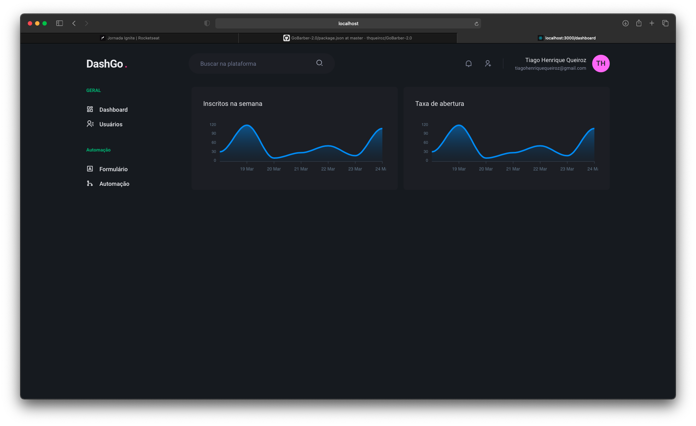
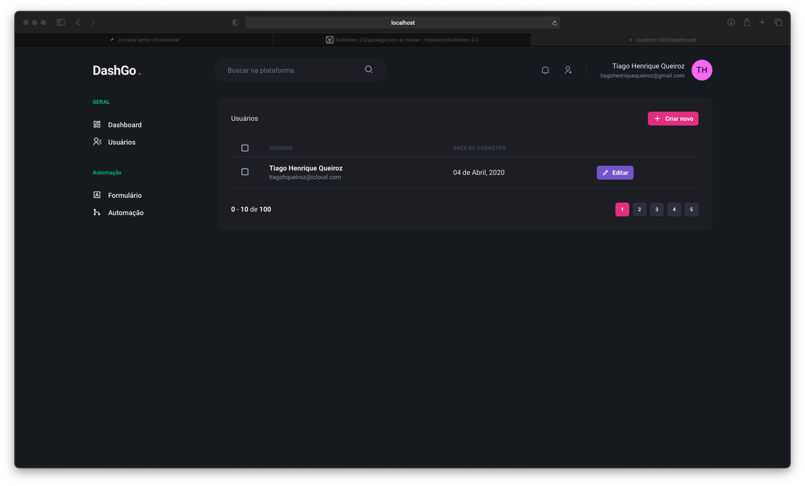

<h3 align="center">
  DashGo
</h3>

<h1 align="center">
  
</h1>

<h1 align="center">
  
</h1>

This project was build for test responsive interfaces using Chakra UI and Next.js.

<blockquote align="center">
“Não espere para plantar, apenas tenha paciência para colher”!(Rocketseat, 2020)
</blockquote>

---

For some questions, send me an email. =] (tiagohenriquequeiroz@gmail.com)
